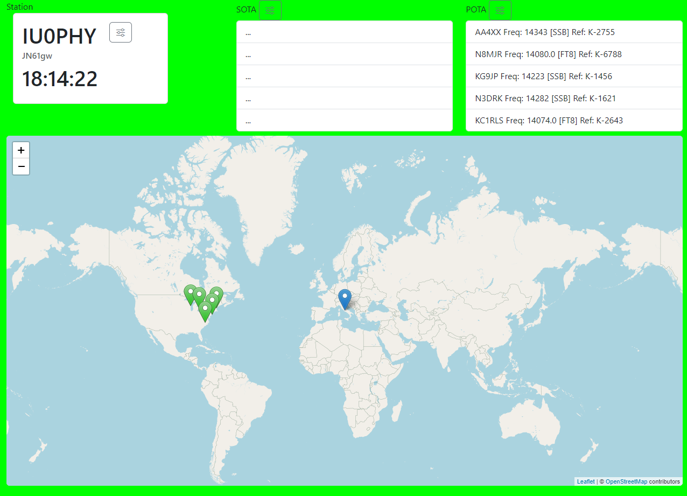

# JSHamClock

JS Ham Clock, is a single page web application that you can use as a spcial Ham Station Clock. Based on HTML, Bootstrap and vanilla JS.

Click on the link of page to open it, and configure:

[https://bobboteck.github.io/jshamclock/](https://bobboteck.github.io/jshamclock/)

## History

Current version is the v0.0.5, the picture below show the app, consider it as a pre alpha version!

